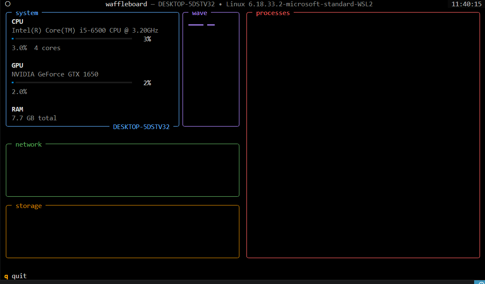

# waffleboard

a terminal-based linux security process monitor, inspired by `btop`

this is the **v1.0 base monitor**: a clean animated TUI showing live
**CPU / GPU / RAM / HDD** usage as percentage bars. process-level
security analysis (suspicious process detection, hashing, reporting)
is planned for later versions — see [roadmap](#roadmap).

waffleboard ships as a single self-contained script (`waffleboard.py`)
on purpose — no python packaging, no `setup.py`, no folder structure
to get right. just three files in one folder.

## preview

bordered cards in a 2x2 grid, each with a title, an animated
progress bar, and a detail line (cores / GB used / GPU vendor). card
borders and bars shift color — green → yellow → red — as usage rises,
giving it a security-dashboard feel.

## requirements

- linux (preferably debian based, but works on all)
- python 3.9+
- a terminal that supports at least 256 colors (most modern terminals do)

## Files

make sure these three files are together in the **same folder**
before installing:

```bash - your folder
waffleboard.py       # the app
requirements.txt     # dependencies
install.sh            # installer
```

if you downloaded them individually, double check they landed flat
in one folder (not nested) — `install.sh` will tell you clearly if
`waffleboard.py` isn't where it expects.

## install & Run

### option 1 — install script (recommended)

```bash
git clone https://github.com/boryswdev/waffleboard
cd waffleboard
chmod +x install.sh
./install.sh
```

this creates an isolated virtual environment under
`~/.local/share/waffleboard`, installs Textual/Rich/psutil into it,
and drops a launcher at `~/.local/bin/waffleboard`.

make sure `~/.local/bin` is on your `PATH`:

```bash
export PATH="$HOME/.local/bin:$PATH"
```

(add that line to your `~/.bashrc` or `~/.zshrc` to make it permanent)

then just run:

```bash
waffleboard
```

### option 2 — run without installing

```bash
git clone https://github.com/boryswdev/waffleboard
pip install -r requirements.txt --break-system-packages
python3 waffleboard.py
```

or inside a venv of your own:

```bash
git clone https://github.com/boryswdev/waffleboard
python3 -m venv venv
source venv/bin/activate
pip install -r requirements.txt
python3 waffleboard.py
```

## controls

| Key | Action              |
|-----|----------------------|
| q   | Quit                 |

stats auto-refresh every second.

## roadmap

this v1.0 is intentionally minimal so it can be tested end-to-end first.
planned next steps, per the original
project proposal:

- [ ] live process table (PID, user, CPU%, MEM%, command)
- [ ] simple security heuristics (e.g. processes running from `/tmp`,
      unusual network connections, unsigned/unexpected binaries)
- [ ] SHA256 hashing of executables via `hashlib`, flag hash changes
- [ ] network connection view via `psutil` + `socket`
- [ ] JSON export of findings via `json` / `pathlib` # who is json??
- [ ] process drill-down / kill from the UI
- [ ] config file for custom rules and thresholds

## other

please give me feedback!! you can reach me at: 

```bash
email -> boryswdev@gmail.com
discord -> whatwaffles
```

enjoy!!

current = 
